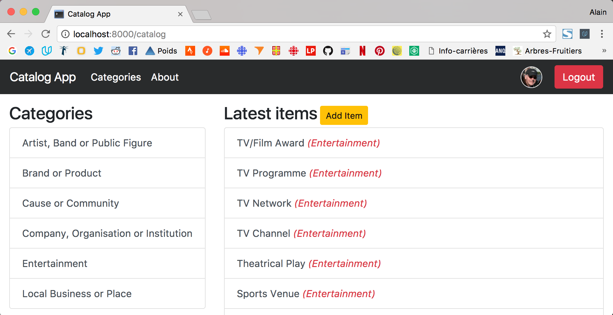

# Catalog App

## Description
This application provides a list of items within a variety of categories. 
The list of categories and items comes from [Facebook Pages for Marketing](https://www.facebook.com/business/products/pages). 
"Page type" (Local Business or Place, Company, Organization or Institution, ...) and "Category" from this Facebook page represents respectively "category" and "item" for this project.

This app is based upon:
- [Python](https://www.python.org/)
- [Flask](http://flask.pocoo.org) 
- [SQLAlchemy](http://www.sqlalchemy.org)
- [SQLite](https://www.sqlite.org/)
- [oauth2client](https://github.com/google/oauth2client)
- [Bootstrap v4.0.0-beta](https://getbootstrap.com/)
- [jQuery](https://jquery.com/)

A third party authentication system (Google and Facebook) is implemented to let users add, update and delete items. 

This app implements also API endpoints with responses formatted in JSON.

This web app is a project for the Udacity [Full Stack Web Developer Nanodegree](https://in.udacity.com/course/full-stack-web-developer-nanodegree--nd004/).
So, this application has been developed for an educational purpose.


## Requirements

- [Vagrant](https://www.vagrantup.com/)
- [VirtualBox](https://www.virtualbox.org/)

We assume that [Flask](http://flask.pocoo.org), [SQLAlchemy](http://www.sqlalchemy.org), 
[SQLite](https://www.sqlite.org/) and [oauth2client](https://github.com/google/oauth2client) 
are already installed in the virtual machine (VM).

## Set Up and run the application

Please follow these steps to set up and run the application.

Download or clone the [catalog-app](https://github.com/boisalai/catalog-app) repository under `/catalog` and move this directory under your `/vagrant` directory (like that: `/vagrant/catalog`).

Launch the Vagrant VM from inside the `/vagrant` folder with:

```bash
$ vagrant up
$ vagrant ssh
```

Then move inside the catalog folder. 

```bash
$ cd /vagrant/catalog
```

Create and populate the database.

```bash
$ python data.py
```

Run the application.

```bash
$ python application.py
```

Open your web browser to this URL: http://localhost:8000

## Screenshot

You should see something like this.



## API endpoints

| Request | Methods | What you get | 
| ------------- |-------------|---------|
| /catalog.json | GET | All categories with their items. |
| /v1/categories | GET | All categories with their items. |
| /v1/categories/*category_name* | GET | A specific category with his items. |
| /v1/categories/*category_name*/*item_title* | GET | A specific item. |

## License

The contents of this repository are covered under the [MIT License](LICENSE).

